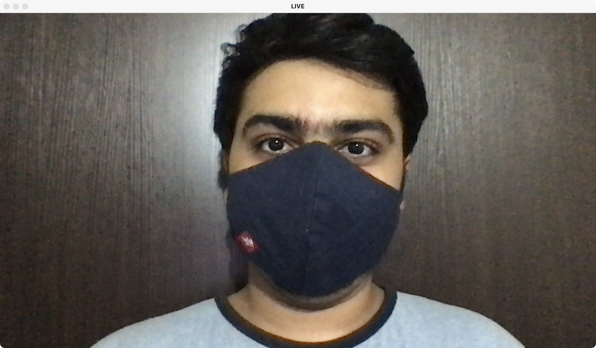
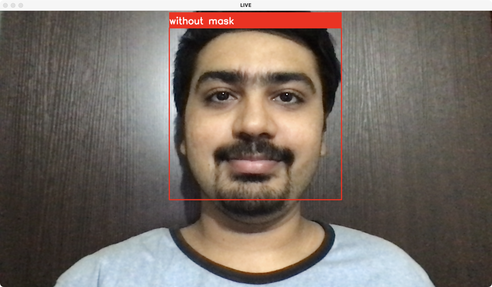

# Face Mask Detection

    


<br/>  
<br/>  


## Table Of Contents
- [Introduction](#introduction)
- [Setup](#setup)
- [About the Application](#about-the-application)
  - [Models](#models)
  - [Home Page](#home-page)
  - [Registration Page](#registration-page)
  - [Login Page](#login)
  - [Logout](#logout)
  - [Create Listing](#create-listing)
  - [Listing Page](#listing-page)
  - [Bids](#bids)
  - [Comments](#comments)
  - [Watchlist Page](#watchlist)
  - [My Listing Page](#my-listing-page)
  - [Closed Listing Page](#closed-listing-page)
  - [Closed Listing](#closed-listing)
  - [Category](#category)
  - [About Us Page](#about-us-page)
- [Author](#author)


<br/>  
<br/>  


<div name="introduction">

## Introduction
A python application that detects if person is wearing a mask or not.


<br/>  
<br/>  


<div name="setup">

## Setup

### Cloning the Repository
You can clone this repository by either downloading a zip file or by using the following command.
```
git clone https://github.com/cmn22/mail
```

<br/>

### Creating a virtual environment 
#### For Unix/macOS
1. Installing virtualenv
    ```
    pip3 install virtualenv
    ```
2. Creating a virtual environment
    ```
    virtualenv env
    ```
3. Activating the virtual environment
    ```
    source env/bin/activate
    ```
<br>    

#### For Windows
1. Installing virtualenv
    ```
    pip3 install virtualenv
    ```
2. Creating a virtual environment
    ```
    virtualenv env
    ```
3. Activating the virtual environment
    ```
    .\env\Scripts\activate
    ```

<br/>
<br/>

### Installing required dependencies
Install the required packages as stated in requirements.txt file
```
pip3 install -r requirements.txt
```

<br/>
<br/>

### Training the model
We have to run the train.py file so as to start training the model.
```
python3 train.py
```


<br/>
<br/>

### Testing the model
To start face mask detection on a live feed (using webcam), we have to run the test.py file.
```
python3 test.py
```

<br/>

**NOTE:** Press 'esc' to exit the Live Feed Face Mask Detection window.


<br/>
<br/>


<div name="data-set">

## Image Data Set
1. Images with Mask: 658
2. Images without Mask: 658


<br/>
<br/>


<div name="training">

## Model Training
Breif overiew of the steps involved in training the model are:
1. Load face mask dataset.
2. Train face mask classifier using Keras and Tensorflow.
3. Serialise face mask classifier.
4. Model is ready.


<br/>
<br/>


<div name="testing">

## Face Mask Detection on Live Feed
Breif overiew of the steps for detection of the presensce of face mask are:
1. Load face mask classifier.
2. Detect face in video feed.
3. Extract facial features of each face.
4. Apply face mask classifier on each face using the extracted facial features.
5. Result
    - Mask
    - No Mask


<br/>
<br/>


<div name="result">

## Result

<div name="mask">

### Mask
No alert is shown when mask is detected on the face.

 
<br/>
<br/>

<br/>


<div name="no-mask">

### No Mask
If a face is detected without a mask, a red box is displayed on the face.

 
<br/>
<br/>  


<br/>  


<div name="author">

## Author 

[](
https://www.linkedin.com/in/chaitanya-malani/) 
[](https://github.com/cmn22) [](https://www.facebook.com/itsme.cmn22) [](https://twitter.com/ChaitanyaMalani) [](https://www.instagram.com/itsme.cmn22/)

This project has been made by Chaitanya Malani 

Demonstration of this project can be viewed on [YouTube](https://youtu.be/pdsy5AV5SgQ)

I am an aspiring software engineer who is currently studying Computer Science in Mumbai, India. I love to code and explore various fields within computers. Also I am a very big football enthusiast and I love supporting Manchester United F.C.
